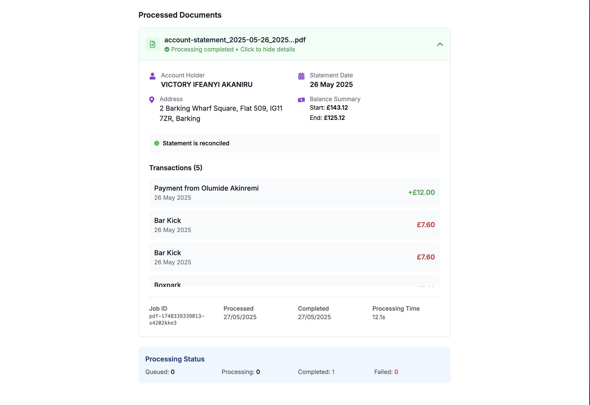

# AI Bank Statement Analyzer

A full-stack Monorepo application for analyzing bank statement PDF files using AI-powered parsing and data extraction.

## Getting Started

Please refer to the individual README files in each folder for specific setup and running instructions:

1. [Backend Setup](./backend/README.md) - API server configuration and startup
2. [Frontend Setup](./frontend/README.md) - React application setup and development

## Screenshots

### Empty Upload Interface

### Results View with Processed Documents

