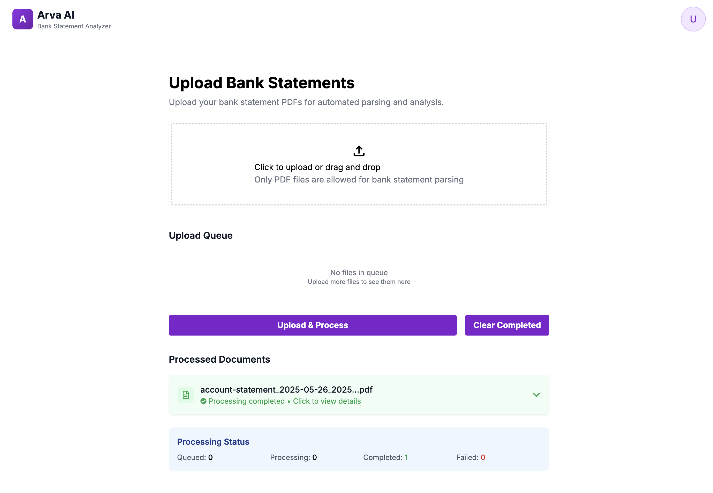
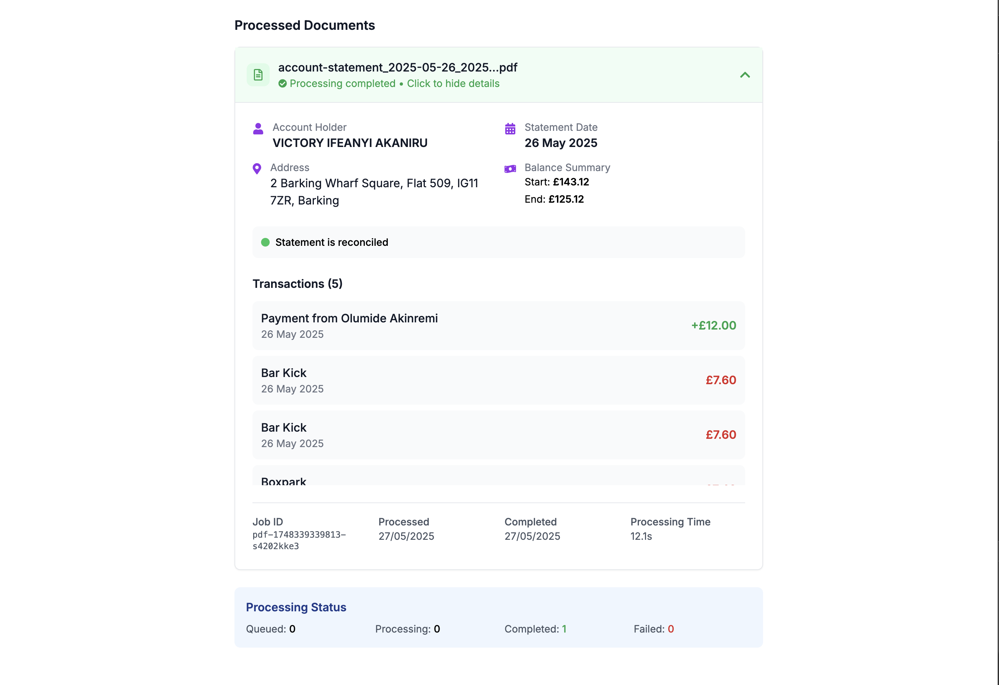

## Description

AI Bank Statement Analyzer - A modern web application for uploading and parsing bank statement PDFs with real-time job tracking and status monitoring.

Built with: [Next.js](https://nextjs.org/)

## Getting Started

First, run the development server:

```bash
npm run dev
# or
yarn dev
# or
pnpm dev
# or
bun dev
```




Check out our [Next.js deployment documentation](https://nextjs.org/docs/deployment) for more details.
